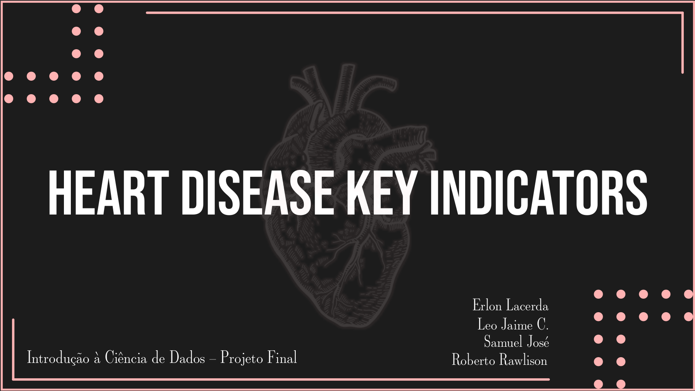

# Projeto ICD
Projeto de Análise de Dados para a disciplina Introdução à Ciência de Dados pela UFPB referente ao semestre 2022.2

## Integrantes
- Erlon Lacerda
- Samuel José
- Leo Jaime Costa
- Roberto Rawlison

---

## [Relatório Final](https://github.com/erlonL/Projeto-ICD/blob/main/projeto.ipynb)

---

## Perguntas:
    - Como o sono impacta na saúde do indivíduo?
    - Como as variáveis influenciam no problema cardíaco?
    - Como os hábitos e fatores controláveis influenciam no surgimento de um problema cardíaco?
    - Como a raça e o sexo podem influenciar em problemas cardíacos?

---
### [Descrição dos Dados](https://github.com/erlonL/Projeto-ICD/blob/main/Descri%C3%A7%C3%A3o%20dos%20Dados.md)

---

## Referências:

[Kaggle - Heart Disease Indicators](https://www.kaggle.com/datasets/kamilpytlak/personal-key-indicators-of-heart-disease)

---